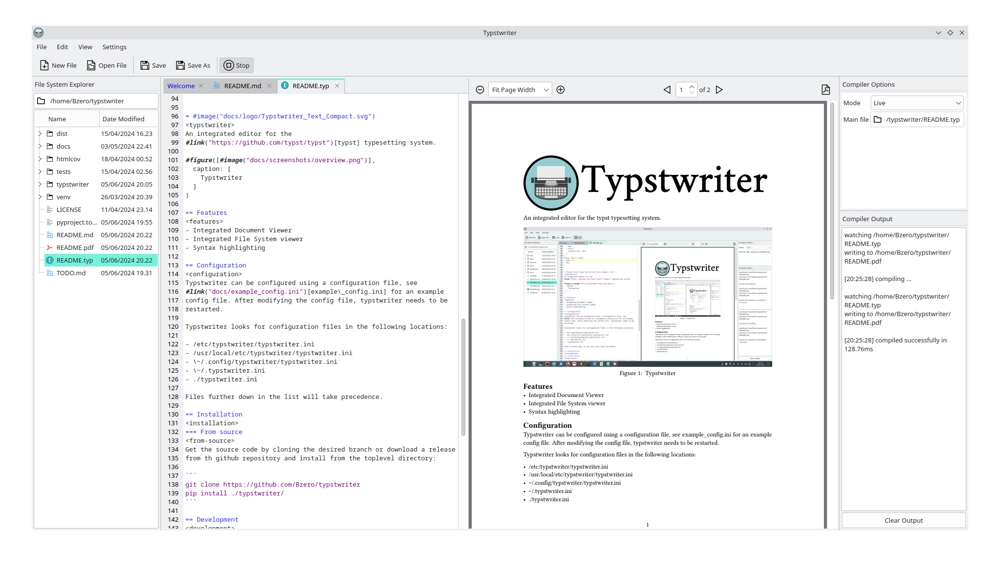

# 

An integrated editor for the [typst](https://github.com/typst/typst) typesetting system.



## Features

* Integrated Document Viewer
* Integrated File System viewer
* Syntax highlighting

## Configuration

Typstwriter can be configured using a configuration file, see [example_config.ini](docs/example_config.ini) for an example config file. After modifying the config file, typstwriter needs to be restarted.

Typstwriter looks for configuration files in the following locations:

* /etc/typstwriter/typstwriter.ini
* /usr/local/etc/typstwriter/typstwriter.ini
* Platform specific configuration directory:
	* $XDG_CONFIG_HOME/typstwriter/typstwriter.ini
	* %USERPROFILE%\AppData\Local\typstwriter\typstwriter\typstwriter.ini
* ~/.typstwriter.ini
* ./typstwriter.ini

Files further down in the list will take precedence.

## Installation

### Using pip:

Typstwriter is available on [PyPI](https://pypi.org/project/typstwriter/). To install using `pip` simply use:

```
pip install typstwriter
```

### From source

Get the source code by cloning the desired branch or download a release from th github repository and install from the toplevel directory:

```
git clone https://github.com/Bzero/typstwriter
pip install ./typstwriter/
```

### Install typst
Independently of the installation method chosen, the `typst` CLI has to be available to compile typst documents. Consult the [typst repository](https://github.com/typst/typst#installation) for details on installing `typst`. Alternatively, the path of a `typst` executable can be specified in the [configuration file](#Configuration).

## Development

Clone the repository

```
git clone https://github.com/Bzero/typstwriter/
```

Install typstwriter in edit mode

```
pip install -e ./typstwriter/
```

Run the tests with pytest to make sure that everything is working correctly. Inside the source directory, run:

```
pytest
```

Activate pre-commit hooks to automatically check changes before committing. Inside the source directory, run:

```
pre-commit install
```

## Contributing

Contributions are always welcome!

* Open an [Issue](https://github.com/Bzero/typstwriter/issues) to report bugs or request features.
* Use the [discussion](https://github.com/Bzero/typstwriter/discussions) to give feedback.
* Send a [Pull request](https://github.com/Bzero/typstwriter/pulls) to propose new features.

## License

Typstwriter is licensed under the [MIT license](LICENSE). 
